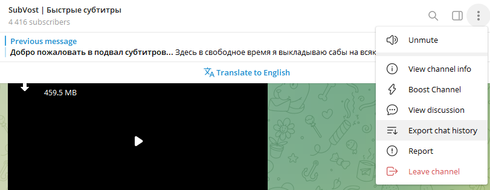
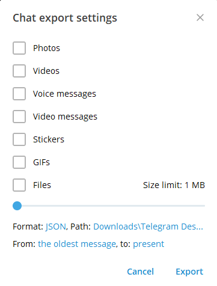

# Парсер аниме с постов телеграм канала SubVost

## Требования
- php: ^8.3

## Запуск

Для начала нужно сделать экспорт сообщений с канала в формате json. 



Формат должен быть json, все остальное можно убрать, необходим только текст сообщений.



В скачанной папке будет файл result.json, его нужно скопировать в директорию с проектом, рядом с файлом parser.php

Запустить parser.php

```bash
php parser.php
```

Следите за выводом в консоль, туда выводится информация по сообщениям с которыми парсер не справляется. 
По умолчанию такие сообщения игнорируются. Но лучше их проверить и добавить либо в игнор (файл `messages-to-ignore.php`), 
либо внести информацию по ним самостоятельно (файл `parser-helper.php`).
